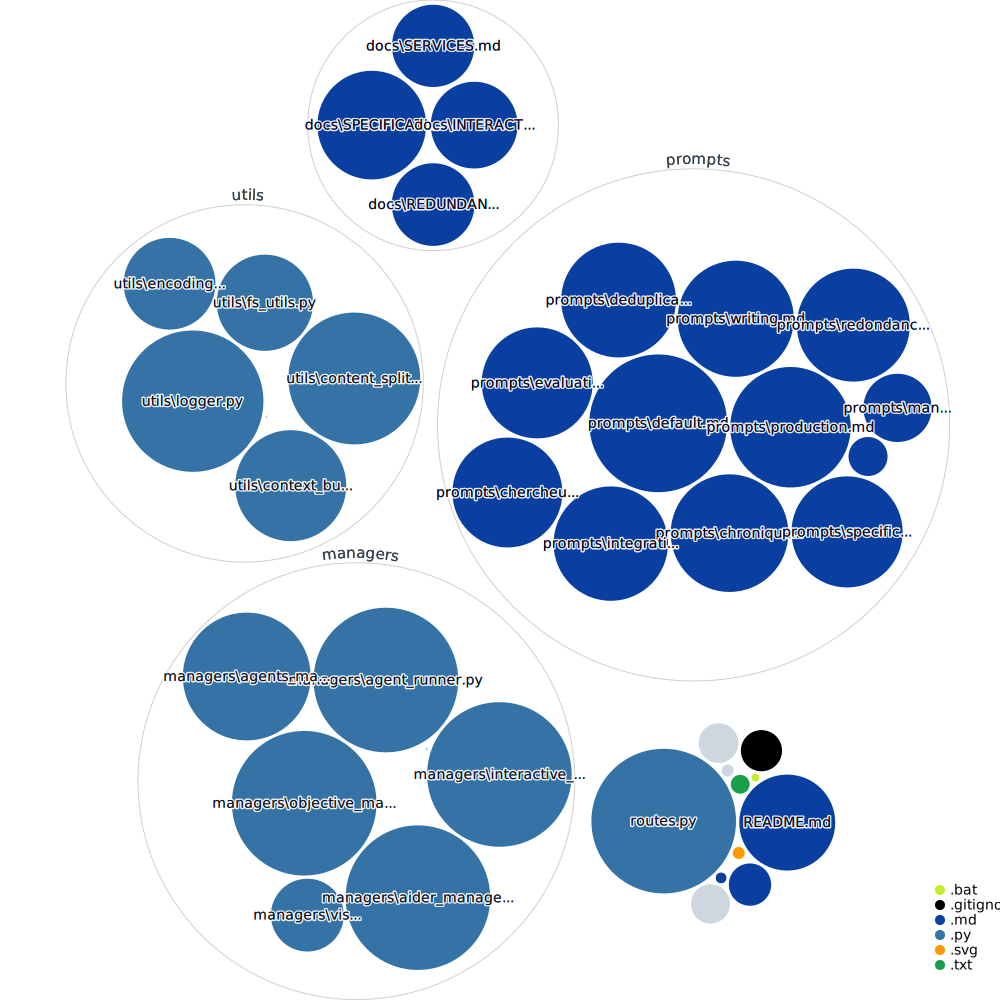

# KinOS v6 - AI Team Orchestration System

## 🌟 Overview

KinOS is an advanced AI team orchestration system that enables autonomous collaboration between specialized AI agents. It uses a file-based architecture to coordinate multiple GPT-4 agents working together on complex projects.

See it in action: https://nlr.ai/

## ✨ Key Features

- 🤖 **Autonomous Agent Teams**: Pre-configured specialized teams for different project types
- 📁 **Directory-Based Operation**: Uses current directory as mission context
- 🔄 **Dynamic Resource Management**: Automatic scaling and resource allocation
- 🔍 **Intelligent Content Management**: Built-in deduplication and content organization
- 🔗 **Git Integration**: Automatic version control and change tracking
- 📊 **Progress Monitoring**: Real-time status tracking and logging

## What's new?
Version 6.1.2 is out! Check the [Changelog](./CHANGELOG.md)

## 📊 Project Structure


## 💡 Best Practices

### Mission Definition
- Be specific and detailed about expected outputs and deliverables
- Include clear format and structure requirements
- Define validation criteria and constraints

### Repository Preparation
- Add relevant reference materials and examples as text files
- Structure directories to match expected output
- Include any required templates or configurations

### Active monitoring
What are the agents up to?
- Check `suivi.md` to get the logs and synthesis of the progress
- Check `todolist.md` to see what work is coming
- Check `diagram.md` to get an overview of the progress

You can also open an interactive session with `kin interactive` and ask it question about the agents' progress.

## 🚀 Getting Started

### Prerequisites

- Python 3.9+ (accessible via 'python3' or 'python')
- Git installed
- Node.js and npm installed (for repository visualization)
- At least one model provider:
  - OpenAI API key (for OpenAI models)
  - Ollama (for local models)
  - OpenRouter API key (for additional providers)
- Perplexity API key (optional, enables research capabilities)

### Optional Model Providers
- **Ollama**: For local model execution
  - Install from [Ollama.ai](https://ollama.ai)
  - Usage: `--model ollama_chat/<model_name>`

- **OpenRouter**: For additional model providers
  - Get API key from [OpenRouter.ai](https://openrouter.ai)
  - Usage: `--model openrouter/<provider>/<model_name>`

- **Default**: OpenAI GPT-4o-mini
  - Requires OpenAI API key
  - Most stable and tested option
  - Usage: `--model gpt-4o-mini` (default)
- Cairo graphics library (for SVG to PNG conversion):
  - Windows: Install GTK3 runtime from [GTK for Windows](https://github.com/tschoonj/GTK-for-Windows-Runtime-Environment-Installer)
  - Linux: `sudo apt-get install libcairo2-dev pkg-config python3-dev`
  - macOS: `brew install cairo pkg-config`

### Installation Steps

1. Verify Prerequisites:
   - Python 3.8+ installed (`python --version`)
   - Git installed (`git --version`)
   - Node.js and npm installed (`node --version`, `npm --version`)
   - Cairo graphics library installed:
     - Windows: Install GTK3 runtime from [GTK for Windows](https://github.com/tschoonj/GTK-for-Windows-Runtime-Environment-Installer)
     - Linux: `sudo apt-get install libcairo2-dev pkg-config python3-dev`
     - macOS: `brew install cairo pkg-config`

2. Clone the Repository:
   ```bash
   git clone https://github.com/yourusername/kinos.git
   cd kinos
   ```

3. Configure Environment:
   ```bash
   cp .env.example .env
   # Edit .env and add your API keys:
   # - OPENAI_API_KEY
   # - PERPLEXITY_API_KEY
   ```

4. Run Installation Script:
   - Windows: `install.bat`
   - Linux/Mac: 
     ```bash
     chmod +x install.sh
     ./install.sh
     ```

The installation script will:
- Update git submodules
- Install Python dependencies
- Set up custom Aider
- Build repo-visualizer
- Add KinOS to your PATH

### Updating KinOS

To update KinOS to the latest version:

```bash
# Windows
install.bat update

# Linux/Mac
./install.sh update
```

This will:
- Pull the latest changes from the repository
- Update all submodules
- Update Python dependencies
- Rebuild components as needed

### Starting Your First Project

1. Create a new project directory:
```bash
mkdir my_project
cd my_project
```

2. Create a aider.mission.md file:
```bash
# Create .aider.mission.md file
# This file describes what you want to accomplish
# Example content:
"""
# Project Mission: Create a Python Web Scraper

## Objective
Build a web scraper that can:
- Extract data from e-commerce websites
- Save results to CSV files
- Handle pagination and rate limiting
- Respect robots.txt

## Requirements
- Use Python with BeautifulSoup
- Include error handling
- Add comprehensive documentation
- Create unit tests
"""
```

3. Launch KinOS:
```bash
# Generate and start 6 parallel agents
kin run agents --generate --count 6
```

4. Monitor Progress:
- Check `suivi.md` for detailed logs
- View `diagram.svg` for your repository diagram 
- Review `todolist.md` for pending tasks

## 📖 Usage

### Basic Commands

```bash
# Launch with default configuration
kin run agents

# Launch with specific model
kin run agents --model <model_name>  # Use any supported model

# Use with local models via Ollama
kin run agents --model ollama_chat/llama3.1:70B  # Use local Llama 3.1

# Use with model routers
kin run agents --model openrouter/anthropic/claude-3-5-haiku  # Use Haiku 3.5 via OpenRouter

# Generate new agents
kin generate agents

# Launch an interactive session with the project
kin interactive
```

### Required Environment Variables
```bash
OPENAI_API_KEY=your_openai_key_here        # Required for all operations
PERPLEXITY_API_KEY=your_perplexity_key_here # Required for research capabilities
```

### Common Operations

1. **Start a New Project**
```bash
# Create project directory
mkdir my_project
cd my_project

# Create mission file
echo "Project mission details..." > .aider.mission.md

# Launch KinOS
kin run agents

# add --verbose to any command to get more info
```

## 🛠️ Core Components

### Agent Types

1. **SpecificationAgent**: Requirements analysis and documentation
2. **ManagementAgent**: Project coordination and resource allocation
3. **writingAgent**: Content creation and documentation
4. **EvaluationAgent**: Quality assurance and testing
5. **DeduplicationAgent**: Content organization and redundancy management
6. **chroniclerAgent**: Progress tracking and logging
7. **redundancyAgent**: Backup and consistency management
8. **ProductionAgent**: Code/content generation
9. **researcherAgent**: Research and analysis
10. **IntegrationAgent**: System integration and deployment

### Possible Use-cases

- 📚 Book Writing
- 🔬 Literature Reviews
- 💻 Coding
-  Business Plans
- Company Documentation

## 🤝 Contributing

We welcome contributions! Feel free to reach out directly to me: contact on https://nlr.ai/

## 📄 License

This project is licensed under the MIT License - see the LICENSE file for details.

## 🙏 Acknowledgments

- Aider for enabling AI-assisted development
- The AutonomousAI community for pioneering autonomous AI development
- Claude for being an awesome collaborator

## 📞 Support

- Telegram: https://t.me/+KfdkWFNZoONjMTE0
- Website: https://nlr.ai/
- Patreon: https://www.patreon.com/c/kins_autonomousais/membership

## 🔮 Future Plans

- Packaged version
- GUI
- Improved agent convergence

---

Made with ❤️ by NLR, Claude & the KinOS Community
