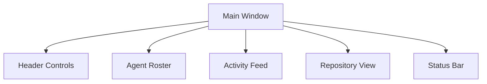

# KinOS GUI Specification

## 1. Layout Overview

### 1.1 Main Window Structure
- Fixed header with controls
- Left sidebar with agent roster
- Main content area (flexible grid)
- Bottom status bar

### 1.2 Core Components

## 2. Component Specifications

### 2.1 Agent Roster (Left Panel)
- **Agent Cards**
  - Generated profile picture (unique per agent)
  - Agent name and type
  - Current status indicator (active/idle)
  - Last action summary
  - Progress indicator
- **Layout**
  - Scrollable vertical list
  - Compact but readable cards
  - Visual status indicators
  - Hover effects for more details

### 2.2 Control Panel (Header)
- **Mission Controls**
  - Edit Mission button (opens mission.md editor)
  - Edit Todolist button (opens todolist.md editor)
  - Save/Cancel buttons for editors
- **Agent Controls**
  - Start/Stop all agents button
  - Agent count slider/input (1-10)
  - Parallel execution limit control
- **System Status**
  - Current mission status
  - Active agent count
  - System resource indicators

### 2.3 Repository Visualization (Main Area)
- **Diagram Display**
  - Auto-generated repository diagram
  - Zoom controls
  - Pan navigation
  - Auto-refresh on changes
- **Interaction**
  - Click to focus components
  - Hover for details
  - Double-click to open files

### 2.4 Activity Feeds (Right Panel)
- **Commit History**
  - Recent git commits
  - Author and timestamp
  - Commit message
  - Changed files count
- **Suivi Log**
  - Chronological activity log
  - Agent actions and results
  - System events
  - Error notifications

### 2.5 Status Bar (Bottom)
- Current system status
- Error count
- Active processes
- Resource usage

## 3. Interaction Patterns

### 3.1 Agent Management
- Click agent card to see details
- Right-click for agent-specific actions
- Drag to reorder priority
- Double-click for full history

### 3.2 File Editing
- Built-in editor for mission.md
- Built-in editor for todolist.md
- Syntax highlighting
- Auto-save option
- Version history access

### 3.3 Visualization Controls
- Zoom in/out buttons
- Fit to window option
- Toggle file details
- Export diagram option

## 4. Visual Design

### 4.1 Color Scheme
- Light/Dark mode support
- Status-based colors:
  - Success: Green (#4CAF50)
  - Warning: Orange (#FF9800)
  - Error: Red (#F44336)
  - Info: Blue (#2196F3)
  - Idle: Gray (#9E9E9E)

### 4.2 Typography
- System native font stack
- Monospace for code/logs
- Clear hierarchy:
  - Headers: 16-20px
  - Body: 14px
  - Details: 12px

### 4.3 Icons
- Material Design icons
- Status-specific indicators
- Action-specific buttons
- Consistent sizing

## 5. Technical Requirements

### 5.1 Performance
- Lazy loading for history
- Efficient DOM updates
- Optimized image handling
- Smooth animations

### 5.2 Responsiveness
- Minimum window size: 1024x768
- Responsive layout adjustments
- Collapsible panels
- Touch-friendly controls

### 5.3 Data Updates
- Real-time agent status
- Periodic diagram updates
- Immediate control feedback
- Websocket for live updates

## 6. Accessibility

### 6.1 Core Features
- Keyboard navigation
- Screen reader support
- High contrast mode
- Focus indicators

### 6.2 Aria Labels
- Meaningful descriptions
- Status announcements
- Action explanations
- Error notifications

## 7. Implementation Notes

### 7.1 Framework Requirements
- React-based UI
- Electron wrapper
- Material-UI components
- D3.js for visualizations

### 7.2 State Management
- Redux for global state
- Local state for UI
- Persistent settings
- Cache management

### 7.3 File Handling
- Native file system API
- Auto-save support
- Backup creation
- Change detection

## 8. Future Enhancements

### 8.1 Planned Features
- Custom agent avatars
- Advanced visualization filters
- Performance analytics
- Team collaboration tools

### 8.2 Integration Points
- CI/CD pipeline status
- External tool connections
- Cloud synchronization
- Plugin system

## Remember
- Focus on user experience
- Maintain consistent design
- Ensure responsive feedback
- Prioritize stability
